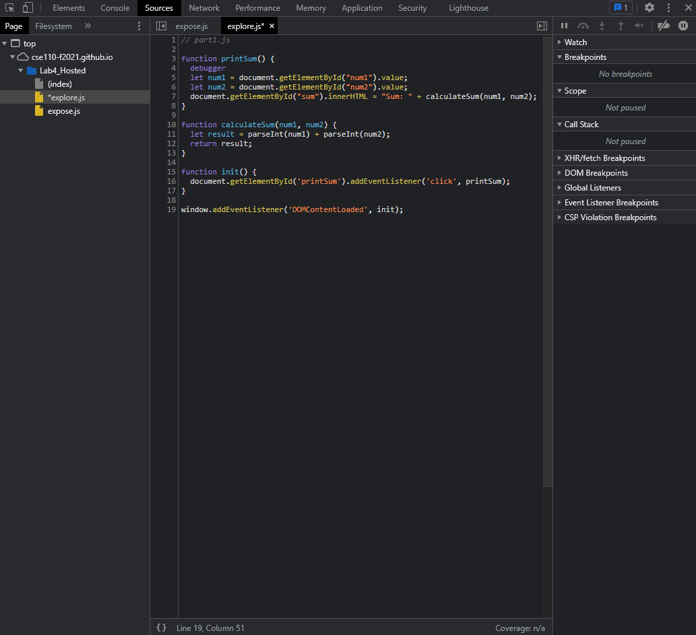

DevTools Part 2

---
1. `num1` and `num2` are both processed as strings. The input strings are concatenated when they should be converted to integers and added.
2. I would fix it by parsing the input strings as integers in the function `calculateSum(num1, num2)`.
---

